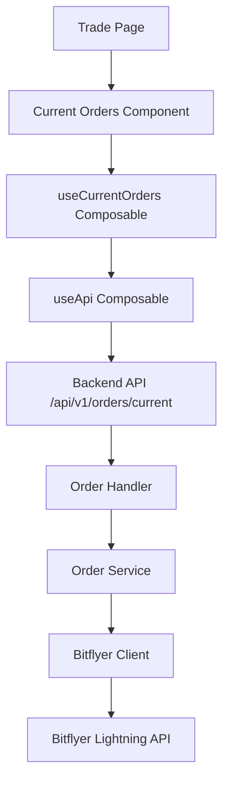

# 設計書

## 概要

Current Ordersコンポーネントは、Tradeページに統合される新しいUIコンポーネントで、Bitflyer Lightning APIから取得した未約定の売買注文をリアルタイムで表示します。このコンポーネントは10秒間隔で自動更新を行い、ユーザーに最新の注文状況を提供します。

## アーキテクチャ

### システム構成



### レイヤー構成

1. **プレゼンテーション層**: CurrentOrders.vue コンポーネント
2. **ロジック層**: useCurrentOrders composable
3. **API層**: useApi composable
4. **バックエンドAPI層**: Order Handler
5. **サービス層**: Order Service
6. **外部API層**: Bitflyer Client

## コンポーネントとインターフェース

### フロントエンド コンポーネント

#### CurrentOrders.vue
- **責任**: 未約定注文の表示とUI管理
- **プロパティ**: なし（内部でデータを管理）
- **イベント**: なし
- **機能**:
  - 買い注文と売り注文の分離表示
  - 10秒間隔の自動更新
  - ローディング状態とエラー状態の管理
  - レスポンシブデザイン

#### useCurrentOrders Composable
- **責任**: 注文データの取得と状態管理
- **機能**:
  - 自動更新タイマーの管理
  - API呼び出しとエラーハンドリング
  - データの変換とフィルタリング
  - コンポーネントのライフサイクル管理

### バックエンド API

#### GET /api/v1/orders/current
- **責任**: 現在の未約定注文を返す
- **パラメータ**:
  - `pair` (optional): 通貨ペア（"BTC_JPY" | "ETH_JPY"）。省略時は両方のペアの注文を返す
  - `limit` (optional): 各タイプ（買い/売り）の最大返却数（デフォルト: 10）
- **レスポンス**: CurrentOrdersResponse
- **認証**: 必要（Bitflyer API認証）
- **例**: 
  - `GET /api/v1/orders/current` - 全ペアの注文を取得
  - `GET /api/v1/orders/current?pair=BTC_JPY` - BTC/JPYの注文のみ取得
  - `GET /api/v1/orders/current?limit=5` - 各タイプ最大5件まで取得

### データモデル

#### CurrentOrder (フロントエンド)
```typescript
interface CurrentOrder {
  id: string
  type: 'buy' | 'sell'
  pair: 'BTC/JPY' | 'ETH/JPY'
  price: number
  amount: number
  createdAt: string // ISO 8601 format
}
```

#### CurrentOrdersRequest (API パラメータ)
```typescript
interface CurrentOrdersRequest {
  pair?: 'BTC_JPY' | 'ETH_JPY'  // 省略時は両方のペア
  limit?: number                 // デフォルト: 10
}
```

#### CurrentOrdersResponse (API)
```typescript
interface CurrentOrdersResponse {
  buyOrders: CurrentOrder[]
  sellOrders: CurrentOrder[]
  timestamp: number
  pair?: string                  // リクエストで指定された場合のみ
}
```

#### BitflyerChildOrder (バックエンド)
```go
type BitflyerChildOrder struct {
    ID                     int64   `json:"id"`
    ChildOrderID           string  `json:"child_order_id"`
    ProductCode            string  `json:"product_code"`
    Side                   string  `json:"side"`
    ChildOrderType         string  `json:"child_order_type"`
    Price                  float64 `json:"price"`
    AveragePrice           float64 `json:"average_price"`
    Size                   float64 `json:"size"`
    ChildOrderState        string  `json:"child_order_state"`
    ExpireDate             string  `json:"expire_date"`
    ChildOrderDate         string  `json:"child_order_date"`
    ChildOrderAcceptanceID string  `json:"child_order_acceptance_id"`
    OutstandingSize        float64 `json:"outstanding_size"`
    CancelSize             float64 `json:"cancel_size"`
    ExecutedSize           float64 `json:"executed_size"`
    TotalCommission        float64 `json:"total_commission"`
}
```

## 正確性プロパティ

*プロパティとは、システムのすべての有効な実行において真であるべき特性や動作のことです。本質的に、システムが何をすべきかについての形式的な記述です。プロパティは、人間が読める仕様と機械で検証可能な正確性保証の橋渡しとして機能します。*

### プロパティ反映

事前作業分析を確認した結果、以下の冗長性を特定しました：

- プロパティ1.3（最大10件表示）とプロパティ5.3（API結果制限）は同じ制限を異なる層でテストしているため、統合可能
- プロパティ1.4（日付降順ソート）とプロパティ5.4（API結果ソート）は同じソート動作を異なる層でテストしているため、統合可能
- プロパティ2.1、2.2、2.3、2.4は数値フォーマットの一貫性として統合可能

### 統合後の正確性プロパティ

**プロパティ1: 注文表示制限と分離**
*任意の*注文データセットに対して、買い注文と売り注文は別々のセクションに表示され、各セクションは最大10件の注文を表示する
**検証対象: 要件 1.2, 1.3, 5.3**

**プロパティ2: 注文ソート一貫性**
*任意の*注文コレクションに対して、注文は作成日時の降順（最新順）でソートされる
**検証対象: 要件 1.4, 5.4**

**プロパティ3: 数値フォーマット一貫性**
*任意の*注文に対して、日付はYYYY/MM/DD HH:MM:SS形式、価格はJPY形式、数量は暗号通貨単位で一貫してフォーマットされる
**検証対象: 要件 2.1, 2.2, 2.3, 2.4**

**プロパティ4: 視覚的区別**
*任意の*注文表示において、買い注文と売り注文は視覚的に明確に区別される
**検証対象: 要件 2.5**

**プロパティ5: 自動更新間隔**
*任意の*コンポーネントマウント状態において、自動更新は正確に10秒間隔で実行される
**検証対象: 要件 3.1**

**プロパティ6: エラー処理の優雅さ**
*任意の*API失敗またはネットワークエラーに対して、システムはUIを壊すことなく適切なエラーメッセージを表示し、回復時に正常動作を再開する
**検証対象: 要件 3.4, 6.1, 6.2, 6.3, 6.5**

**プロパティ7: UI更新の非破壊性**
*任意の*データ更新において、表示の更新はユーザーの操作を妨げない
**検証対象: 要件 3.5**

**プロパティ8: デザイン一貫性**
*任意の*表示状態において、コンポーネントは既存のページコンポーネントと同じスタイリング、色スキーム、デザインパターンを使用する
**検証対象: 要件 4.2, 4.4**

**プロパティ9: レスポンシブ動作**
*任意の*ビューポートサイズにおいて、コンポーネントはモバイルデバイス向けのレスポンシブデザインを維持する
**検証対象: 要件 4.3**

**プロパティ10: 機能非干渉**
*任意の*コンポーネント読み込み状態において、既存のページ機能は影響を受けない
**検証対象: 要件 4.5**

**プロパティ11: API データ構造**
*任意の*API応答において、返される注文は注文ID、タイプ、ペア、価格、数量、作成日時を含む
**検証対象: 要件 5.2**

**プロパティ12: 認証済みデータ取得**
*任意の*認証済みAPIリクエストに対して、システムは認証されたユーザーの未約定注文のみを返す
**検証対象: 要件 5.1**

**プロパティ13: エラーログ記録**
*任意の*エラー発生時において、システムは適切なエラー情報をデバッグ用にログに記録する
**検証対象: 要件 6.4**

**プロパティ14: 可視性ベース動作**
*任意の*コンポーネント可視性状態において、自動更新はコンポーネントが表示されているときのみAPIコールを行う
**検証対象: 要件 7.1**

**プロパティ15: タブ可視性制御**
*任意の*タブ切り替えまたはブラウザ最小化において、システムは自動更新を一時停止し、復帰時に即座に再開する
**検証対象: 要件 7.2, 7.3**

**プロパティ16: レンダリング効率性**
*任意の*注文コレクションにおいて、レンダリングはUIの遅延を防ぎ、スムーズなスクロールと操作を維持する
**検証対象: 要件 7.4, 7.5**

<function_calls>
<invoke name="prework">
<parameter name="featureName">current-orders-component

## エラーハンドリング

### エラーの種類と対応

1. **API通信エラー**
   - ネットワーク接続失敗
   - Bitflyer API認証エラー
   - APIレスポンスタイムアウト
   - 対応: 指数バックオフによる再試行、ユーザーへのエラー表示

2. **データ検証エラー**
   - 無効なAPIレスポンス形式
   - 必須フィールドの欠如
   - 対応: フォールバックメッセージの表示、ログ記録

3. **UI状態エラー**
   - コンポーネントマウント/アンマウント時のタイマーリーク
   - 対応: 適切なクリーンアップ処理

### エラー回復戦略

- **自動回復**: ネットワークエラーは指数バックオフで自動再試行
- **ユーザー通知**: 回復不可能なエラーはユーザーに明確に通知
- **ログ記録**: すべてのエラーは詳細情報とともにログに記録

## テスト戦略

### 二重テストアプローチ

このシステムでは、ユニットテストとプロパティベーステストの両方を使用します：

- **ユニットテスト**: 特定の例、エッジケース、エラー条件を検証
- **プロパティベーステスト**: すべての入力にわたって保持すべき普遍的プロパティを検証

両者は補完的であり、包括的なカバレッジを提供します。ユニットテストは具体的なバグを捕捉し、プロパティテストは一般的な正確性を検証します。

### ユニットテスト要件

ユニットテストは以下をカバーします：
- 特定の例（空の注文リスト、単一注文、最大数の注文）
- コンポーネント間の統合ポイント
- エラー条件の具体例

### プロパティベーステスト要件

- **使用ライブラリ**: Vitest + fast-check（JavaScript/TypeScript用）
- **最小実行回数**: 各プロパティテストは最低100回の反復を実行
- **テストタグ**: 各プロパティベーステストは設計書の正確性プロパティを明示的に参照
- **タグ形式**: `**Feature: current-orders-component, Property {number}: {property_text}**`
- **実装要件**: 各正確性プロパティは単一のプロパティベーステストで実装

### テスト実装ガイドライン

1. 各正確性プロパティは専用のプロパティベーステストで実装
2. テストは設計書のプロパティ番号と説明を明示的に参照
3. スマートジェネレーターを使用して入力空間を適切に制約
4. モックを避け、可能な限り実際の機能をテスト